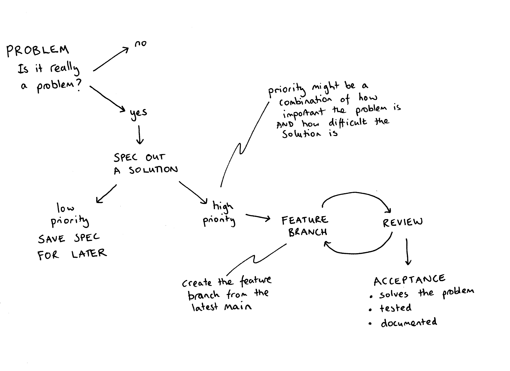

# DART flow

**DART flow** is the workflow to go from having an **idea** for a
feature to getting the feature into the DART **code**, so your feature
can be used **do science**.

1. Describe the problem you are trying to fix. Use GitHub
   [issues](./issues.md) to track the problem. 

2. Add a label to the issue The label helps prioritize the issue. Is it
   a bug fix, is it a new feature, is it refactoring existing code? Use
   the label `back-burner` for something that is low priority.

3. Describe your solution in the issue. Give an estimation of how much
   code this will effect. Will your solution require changing several
   modules? The [writing specifications](./example-spec.md) section of 
   this document gives an example of how to describe your solution.

4. Get some feedback on your solution, the standup is a good place to
   ask for volunteers. This is a good time to have an in-person meeting
   to chat about your spec.

5. Create a [feature branch](./feature-branch.md) to use for your 
   solution. Once you are happy with your
   feature branch, push the branch up to the main DART repo and create
   a [pull request](./pull_request.md).

6. Be as helpful to your reviewers as you can. Only include changes
   relevant to your issue and avoid changes that are not relevant to
   the particular issue.

7. If your pull request is approved, merge into the main branch and
   create a [release](./releases.md).
