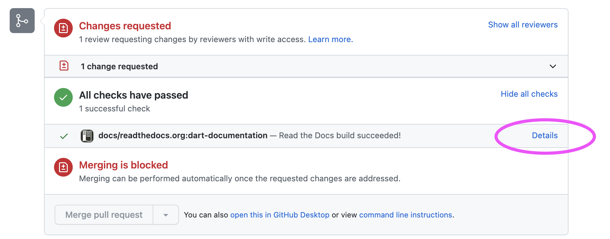

# DART Documentation

The documentation for DART is written in reStructuredText, then
converted to html using Sphinx. The conversion to html is done
automatically by readthedocs, when new content is pushed to a branch.

Documentation is built for pull requests.  You can view the documentation
build by clicking on `show all checks` then `details`.



You can build the DART documentation locally using Sphinx.

### Installing Sphinx Locally

To install Sphinx in a Python virtual environment:

```
python -m venv dev-guide
source dev-guide/bin/activate
pip install Sphinx
```

Copy the following example Makefile to your machine. 

Change the SOURCEDIR line to match where you have DART checked out.

```
# Minimal makefile for Sphinx documentation
#

# You can set these variables from the command line, and also
# from the environment for the first two.
SPHINXOPTS    ?=
SPHINXBUILD   ?= sphinx-build
SOURCEDIR     = /Users/hkershaw/DART/Refactor/Build_system/DART.buildit
BUILDDIR      = dart-docs

# Put it first so that "make" without argument is like "make help".
help:
	@$(SPHINXBUILD) -M help "$(SOURCEDIR)" "$(BUILDDIR)" $(SPHINXOPTS) $(O)

.PHONY: help Makefile

# Catch-all target: route all unknown targets to Sphinx using the new
# "make mode" option.  $(O) is meant as a shortcut for $(SPHINXOPTS).
%: Makefile
	@$(SPHINXBUILD) -M $@ "$(SOURCEDIR)" "$(BUILDDIR)" $(SPHINXOPTS) $(O)
```


To make the docs, run:

```
make html
```

To view the docs:

```
open dart-docs/html/README.html 
```

with your favorite browser.

To deactivate the virtual environment

```
deactivate

