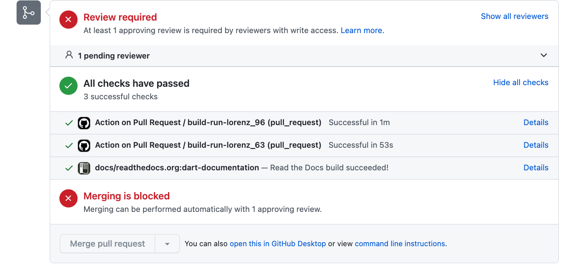
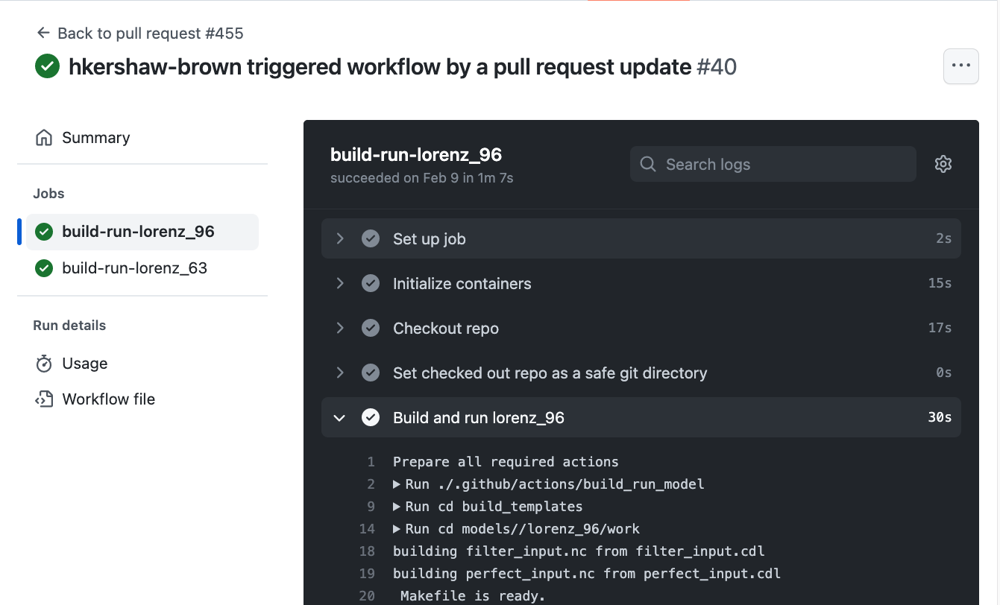

# GitHub Actions

[GitHub Actions]((https://docs.github.com/en/actions/quickstart)) is a software development automation platform that is integrated into GitHub repositories. The platform allows for the creation of several types of automated tasks such as build, test, and deploy. A set of these tasks is referred to as a [workflow](./github-actions-workflow.md).

DART utilizes GitHub Actions to run automated tests when a pull requests is submitted.
The workflow is called `action_on_pull_request.yml`.
The current tests are building and running lorenz\_96 (mpi) and lorenz\_63 (no mpi).

> A pull request can not be merged until the tests pass.

>The tests run on _every_ commit to a pull request, so it is important that the tests run quickly.  The readthedocs documentation build takes ~89 seconds. Aim to beat this time with any tests you add.

You can view the details of each GitHub actions by clicking on `Details`

