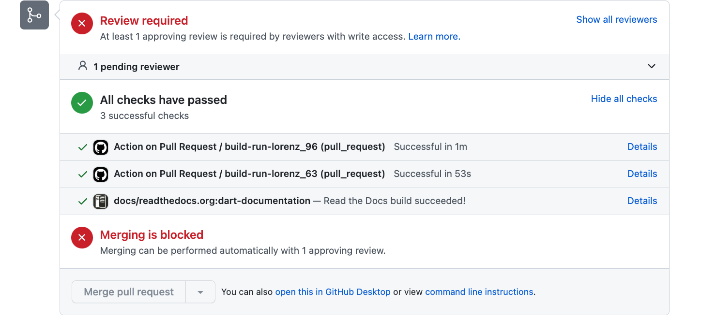
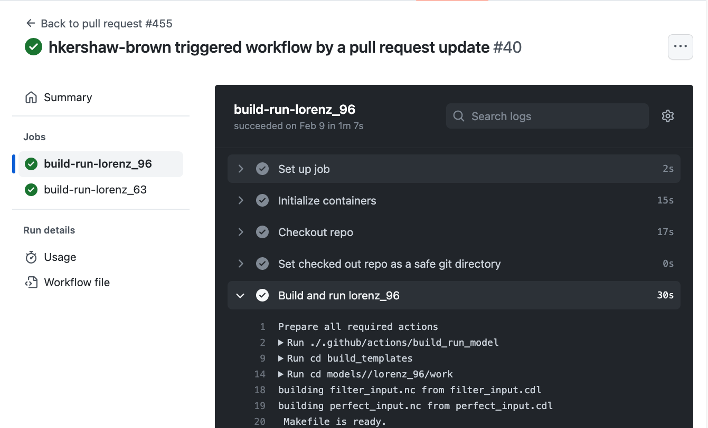

# GitHub Actions

[GitHub Actions]((https://docs.github.com/en/actions/quickstart)) is a software development automation platform that is integrated into GitHub repositories. The platform allows for the creation of several types of automated tasks such as build, test, and deploy. A set of these tasks is referred to as a [workflow](./github-actions-workflow.md).

DART utilizes GitHub Actions to run automated tests when a pull request is submitted.
There are several workflows utilized by DART. The first workflow is called `action_on_pull_request.yml`, which includes tests that build and run lorenz_96 (mpi, mpif08) and lorenz_63 (no mpi).

> A pull request can not be merged until these tests pass.

The second workflow is called `cirrus_action_on_pull_request.yml`. This workflow utilizes the CIRRUS, NSF NCAR's on-prem cloud service, and NCAR HPC containers to run tests that build and run lorenz_96 with all mpi options (mpi, mpif08, nompi). These tests run with all compilers supported in the containers, which currently includes gfortran and nvfortran.

These tests are not required to pass for the pull request to be merged.

You can view the details of each GitHub action by clicking on `Details`

>Both sets of tests run on _every_ commit to a pull request, so it is important that the tests run quickly.  The readthedocs documentation build takes ~89 seconds.  
>
>Aim to beat 89s with any tests you add.
