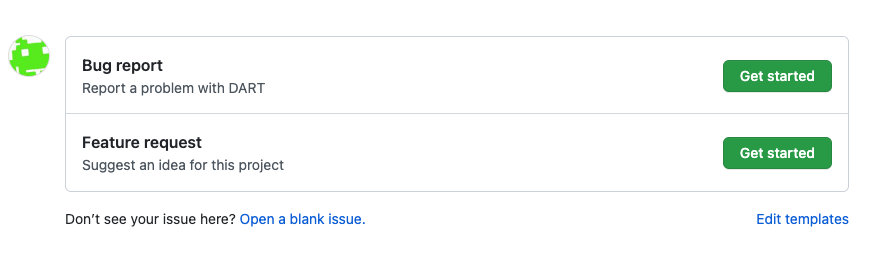

# GitHub

DART is hosted on GitHub

<https://github.com/NCAR/DART>

As a member of the NCAR organization you can create public and
private repositories under the NCAR GitHub organization

<https://github.com/NCAR>

The DART team is:

<https://github.com/orgs/NCAR/teams/dart>

If you are working with people outside the DART team, for example with
summer interns or external collaborators, you may want to create a GitHub
team to manage repository access. For example the team [dart-siparcs](https://github.com/orgs/NCAR/teams/dart-siparcs)
was used for a 2021 SiParCS project.  

There are four main ways developers and users interact with each other
on GitHub:

- [Issues](./issues.md)
- [Bug reports](./bug-reports.md)
- [Pull requests](./reviewing.md)
- [Releases](./releases.md)

At the top level of the DART repositroy is a directory `.github`.  This
contains the templates for pull requests and issues. 

`./github/pull_request_template.md` is the template for pull requests.

`./github/ISSUE_TEMPLATE/bug_report.md` is the template for bug reports.

`./github/ISSUE_TEMPLATE/feature_request.md` is the template for feature requests. 

Blank issues are enabled on the DART repository.  The templates control what
shows up when a user clicks "bug-report" or "feature request".

If you want to edit the `*.md` templates and preview the changes, try the edits
out on a fork of DART.  
