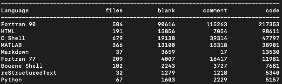

# Welcome to the DART developers handbook

## Goal of this document

A *living* document to describe the DART software workflow. Our current
workflow is using Github.

Things we don\'t have yet:

-   a project management system
-   a release schedule

Things we do have:

-   standups
-   issue tracking via Github
-   code review via pull requests on Github
-   this many lines of code:

