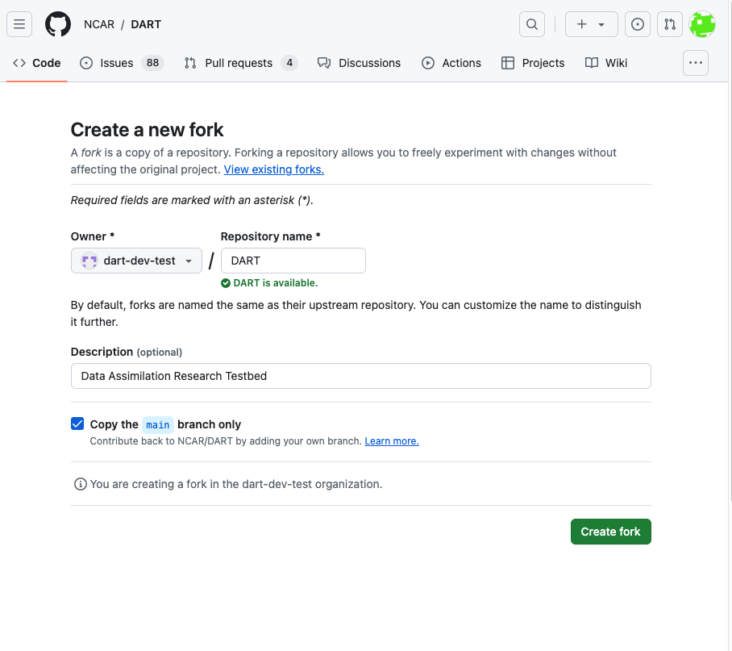

# User reported problems

Here are some tips for working with users when they are reporting problems:

Find out which version of DART a person is using. Ask them to send you the output of

```
git describe --tags
```

The output will give you the following information:

version: v11.4.1
number of commits the user has made to this version: 1

```
v11.4.0-1-ge74ab9573
```

Note the use of --tags in the git describe command. GitHub releases are lightweight tags, rather 
than annotated tags.  If you omit the --tags you'll get the number of commits since the last 
annotated tag:

```
v9.12.refactored-1933-g27f85ee47
```

If the user reports the message is

```
fatal: No names found, cannot describe anything.
```

There are no tags in the repo. The user has forked dart with only the main branch, no branches
or tags. 

The default option for GitHub forks is main branch only.  Unfortunately this means the 
tags are not part of the fork:



