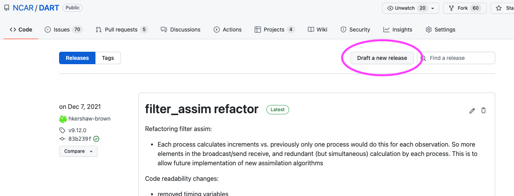

# Creating a Release

The DART releases are available on Github:

<https://github.com/NCAR/DART/releases>

The releases loosely follows the rules of [semantic
versioning](https://semver.org/) with a v at the start, e.g. v9.10.11.

```
vMAJOR.MINOR.PATCH
```

Given a version number vMAJOR.MINOR.PATCH, increment in the following way:

|       |                                                                     |
|-------|---------------------------------------------------------------------|
| MAJOR | version when you make incompatible API changes                      |
| MINOR | version when you add functionality in a backwards compatible manner |
| PATCH | version when you make backwards compatible bug fixes.               |

You may want to use additional labels for pre-release or other code as
extensions to the `vMAJOR.MINOR.PATCH` format.

>Make sure your pull request is up-to-date with main before merging and
>creating a release.

To create a release on Github:

1.  Decide on a tag number following the convention
    `vMAJOR.MINOR.PATCH`

2.  Update the CHANGELOG.rst with the tag and a brief desciption of the
    changes.

3.  Change the version in `conf.py`

4.  Merge into main

5.  Create a release on GitHub from the main branch, by clicking on 
    `Draft a new release`

    

6.  Enter the tag number. Make sure the target branch is main.

7.  Give the release a title and description.

8.  Click publish to create the release.

For a major release or critical bug-fix releases, you may want to email
the dart-users group.
